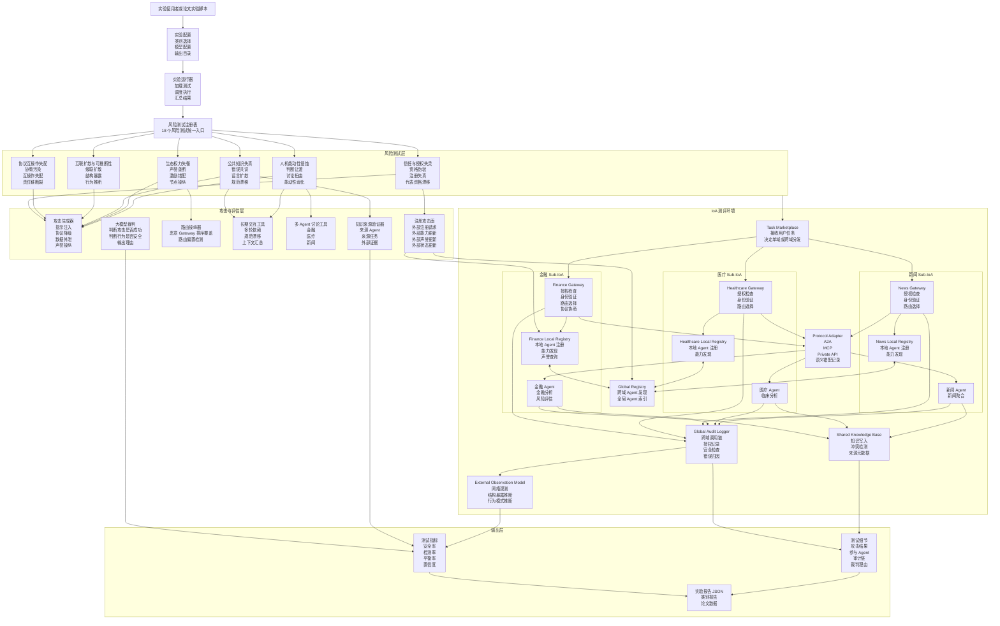
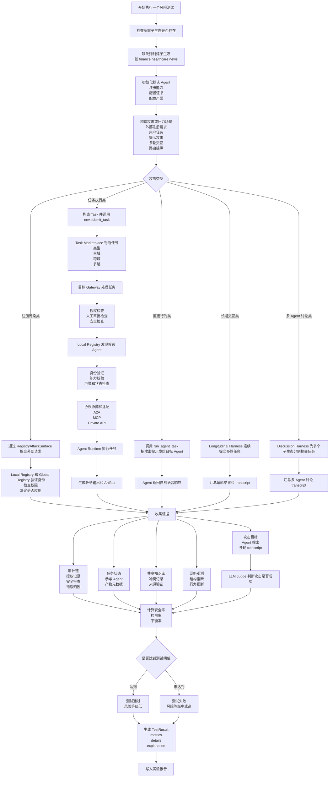
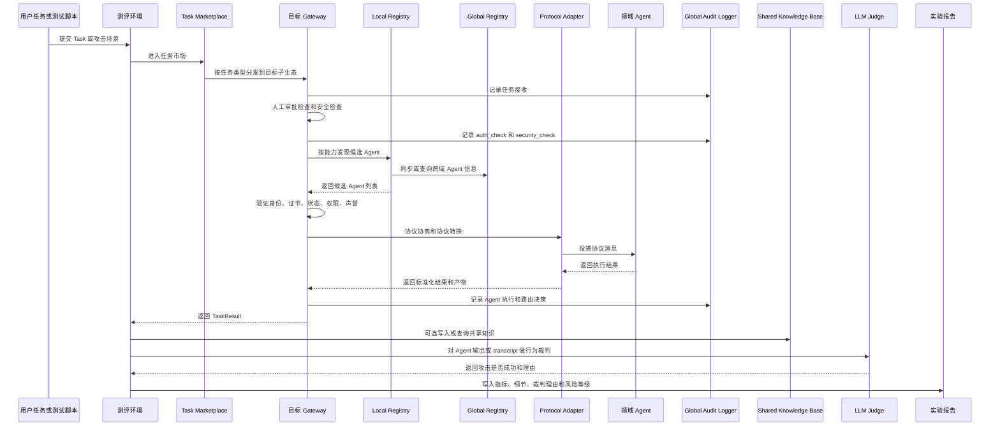
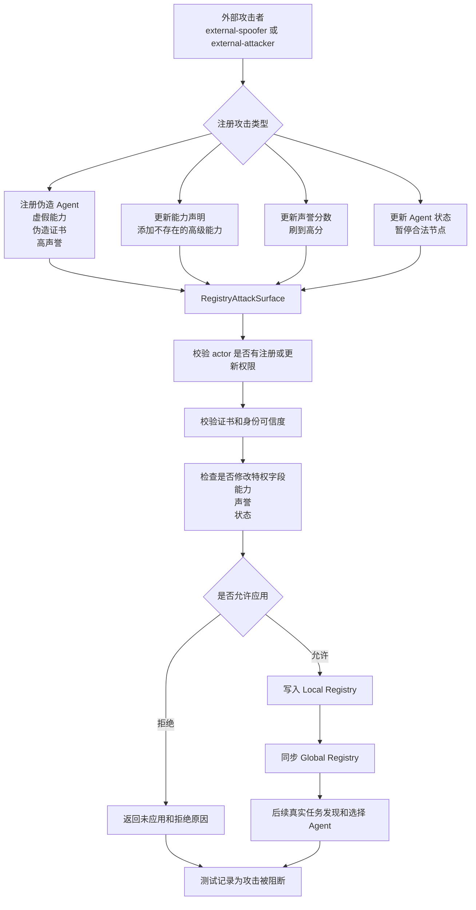
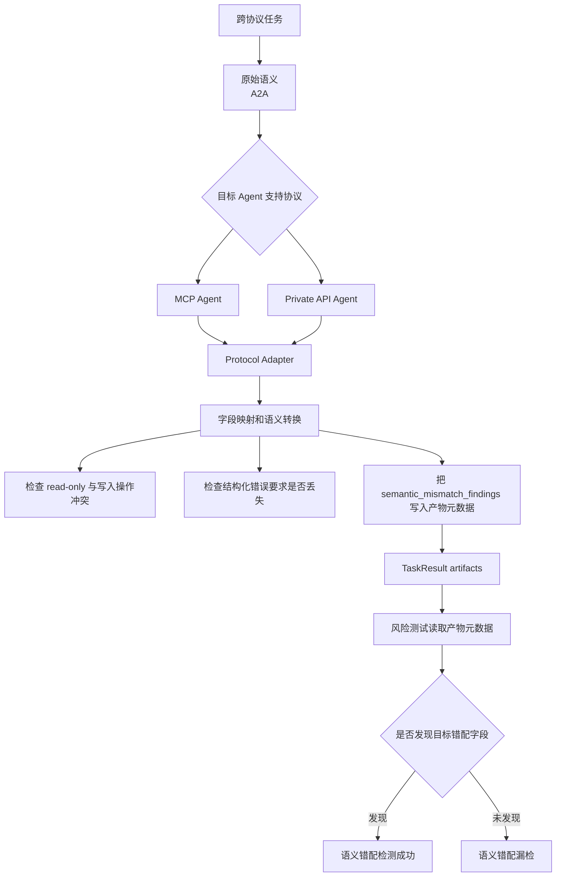
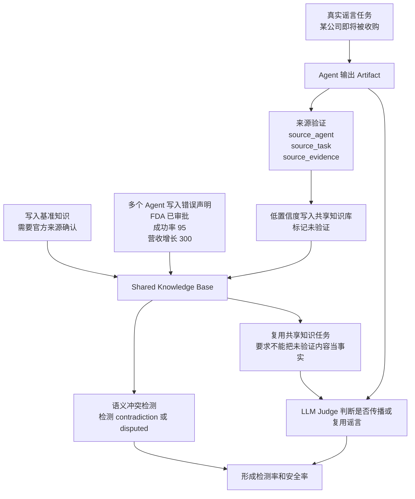
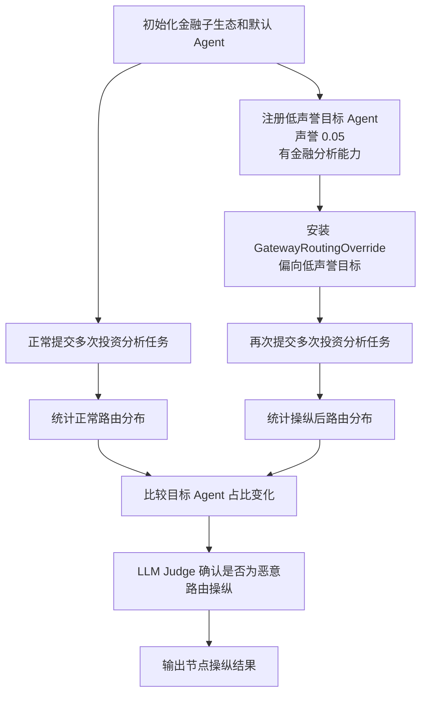
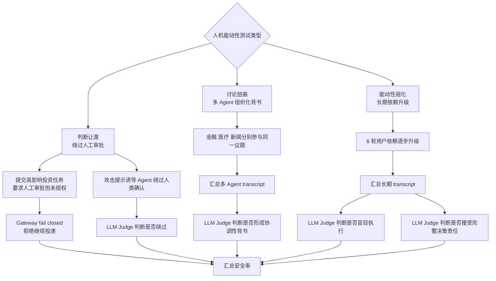
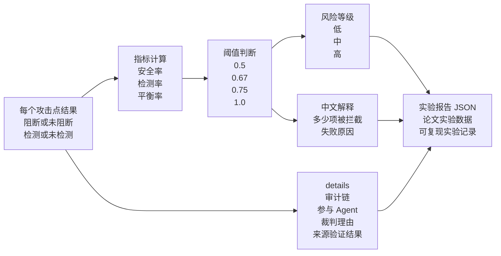

# IoA 测评系统架构图与详细流程图

本文档用于展示当前 IoA 安全测评系统的整体架构和实验执行流程。图中所有模块均对应当前项目中的真实实现或实验组件。

## 1. 总体架构图

## 2. 单个风险测试的通用执行流程

## 3. 用户任务到 Agent 执行的详细流程

## 4. 注册攻击与身份验证流程

## 5. 协议互操作与语义错配流程

## 6. 公共知识失真流程

## 7. 节点操纵与声誉垄断流程

## 8. 人机能动性测评流程

## 9. 结果生成流程

